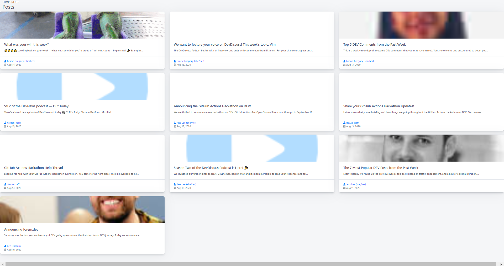

# React Dev Blog



[](https://github.com/sabesansathananthan/react-dev.to-blog/blob/master/.github/LICENSE)
[](https://github.com/sabesansathananthan/react-dev.to-blog)
[](https://github.com/sabesansathananthan/react-dev.to-blog)
[](https://twitter.com/intent/tweet?text=Wow,%20I%20used%20react-dev.to-blog.%20That%20is%20excellent.%20Thank%20you%20@TheSabesan)

## About

Aim of this Project is embed Dev as a blog on your React Website.

## 🛠️ Built with

- [React JS](https://reactjs.org/) - Front-End JavaScript library
- [Shards React](https://designrevision.com/docs/shards-react/getting-started) - React UI Framework

## Installation

To setup the app for development on your local machine, please follow the instructions below:

1. Clone the repo to your machine

```bash
git clone https://github.com/sabesansathananthan/react-dev.to-blog.git
cd react-dev.to-blog
```

2. Install packages

   If you use `npm`

   ```bash
   npm install
   ```

   or

   If you use `yarn`

   ```bash
   yarn
   ```

3. Change username
   Use your dev.to user name👤 instead of `thepracticaldev`. in [Slider.js](./src/components/Slider.js)

```Javascript
blogURL = "https://api.rss2json.com/v1/api.json?rss_url=https://dev.to/feed/thepracticaldev"
```

4. Run the development server

   If you use `npm`

   ```bash
   npm start
   ```

   or

   If you use `yarn`

   ```bash
   yarn start
   ```

5. Visit <http://localhost:3000>

## [Live Demo](https://react-dev-blog.web.app/)

Don't forget to give a star ⭐️ for this repo :smile

## 📄 License

This project is licensed under the MIT License - see the [LICENSE](./.github/LICENSE) file for details
